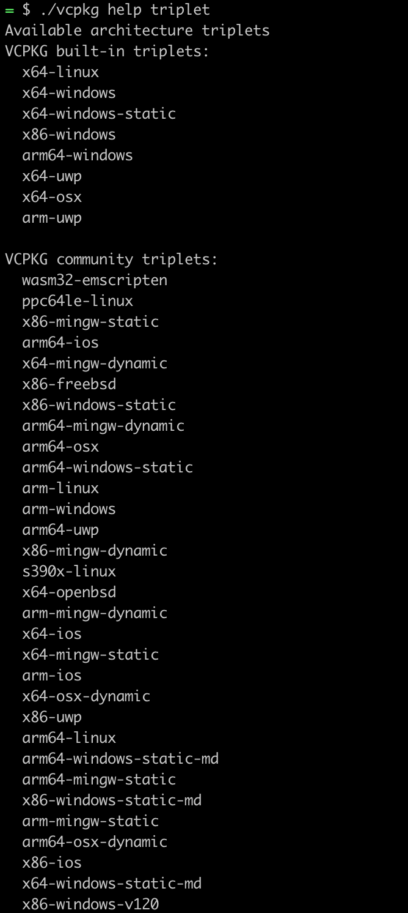

[用法](README_official.md)

### 注意事项
系统中请预先安装(例如使用yum, brew或者源码安装, 而非使用本vcpkg安装): gcc(linux), cmake(>=3.23.2), openssl-devel, glibc-headers, autoconf, autoconf-archive, automake, libtool, bison(thrift), libunwind(gperftools: linux)  

### 定制化ports提交的必要命令
1. 增加或者更新port
2. ./vcpkg format-manifest
3. ./vcpkg x-add-version
### 查看port的历史版本
* git blame -l versions/<port-first-char>-/<portname>.json

### 原生支持和扩展支持的系统
* 对于扩展系统在安装时需要指定--triplet和--host-triplet参数
* 具体支持的系统, 如下图:  

